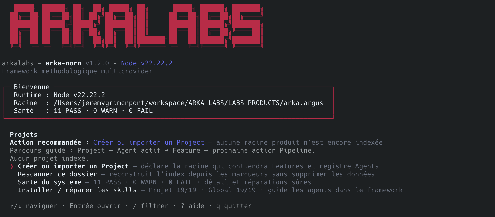

# Arka Norn

<p align="center">
  
</p>

**Le cockpit local qui organise un projet, ses fonctionnalités et le travail de plusieurs agents — sans perdre les décisions, les preuves ni la prochaine étape.**

Arka Norn transforme une intention en livraison vérifiable. Il garde une vue claire du Project, choisit le bon workflow pour chaque Feature, identifie les Agents qui interviennent et refuse de déclarer terminé un travail qui n’a pas passé ses contrôles.

```text
Project → Product principal + Agents spécialisés → Feature → Workflow → Preuves → Validation
```

Il fonctionne localement, depuis une interface terminal guidée, une CLI scriptable ou des skills utilisables par Claude Code, Codex et d’autres providers compatibles.

## Documentation — choisissez votre parcours

| | Point d’entrée | Vous y trouverez |
|---|---|---|
| 👤 | **[Manuel utilisateur](docs/manuel-utilisateur.md)** | Un démarrage en dix minutes, le cockpit, les workflows et les Agents, sans prérequis technique. |
| 🛠️ | **[Guide développeur](docs/guide-developpeur.md)** | L’architecture, les invariants, les extensions, les tests, la sécurité et la release. |
| 🤖 | **[Guide de démarrage Agent](docs/agent-bootstrap.md)** | L’initialisation avec `/arka-norn` ou `$arka-norn`, l’identité, le périmètre et la prochaine action. |
| ⌨️ | **[Référence CLI](docs/cli.md)** | Les commandes scriptables, options, sorties JSON et codes de retour. |

Accès directs : [cockpit TUI](docs/tui.md) · [orchestration multi-Agent](docs/agent-orchestration.md) · [orchestration automatique](docs/automatic-orchestration.md) · [workflow FastDev](docs/fastdev.md) · [catalogue des skills](docs/skills.md) · [dépannage](docs/troubleshooting.md)

## Ce qu’Arka Norn apporte

- **Une prochaine action explicite** : la CLI, la TUI et les Agents consultent le même état réel.
- **Deux workflows adaptés** : un parcours complet pour les Features structurantes et FastDev pour les reworks bornés.
- **Un Product principal stable** : il reste dans la session `main`, organise le Project et prépare les autres Agents.
- **Une session par Agent spécialisé** : architecture, audit, développement et QA travaillent sans écraser leur identité respective.
- **Un pilote assisté, jamais une boîte noire** : le Project choisit explicitement `manual` ou `automatic` ; dans ce dernier mode, Arka explique chaque mission, vous laisse choisir l’assistant et sa version, puis attend votre confirmation.
- **Des livrables signés et vérifiables** : chaque nouveau document nomme son auteur, ses dépendances et ses preuves.
- **Des audits au bon scope** : une Feature utilise son document v3 ; un audit de Project sans Feature utilise l’enveloppe v4 explicite.
- **Des boucles de correction réelles** : une QA ou une validation obsolète ne peut pas terminer la Feature.
- **Une base locale robuste** : marqueurs portables, index réparables, écritures atomiques, locks et journal d’audit.

## Démarrage rapide

### Installer un artefact interne

Arka Norn est distribué en interne sous forme de tarball npm, pas sur le registre public.

```bash
npm install -g ./arka-norn-X.Y.Z.tgz
arka-norn selftest
arka-norn doctor
```

Prérequis : Node.js `22.13` ou plus récent. La [procédure de release](docs/release.md) explique la vérification du checksum et le rollback.

### Ouvrir le cockpit

```bash
cd /chemin/du/projet
arka-norn
```

La TUI accompagne la création ou l’import d’un Project, le choix de la Feature, le démarrage d’un rework et la prochaine action. La touche `?` explique l’écran courant.

### Démarrer avec un Agent

Envoyez simplement le déclencheur adapté dans la conversation principale :

```text
Claude Code : /arka-norn
Codex       : $arka-norn
```

Le premier Agent devient le **Product principal**. Il vérifie le Project, reste dans la session `main`, conseille la suite et peut fournir :

- le prompt exact d’un Agent spécialisé à lancer en parallèle ;
- un mode `prepare` en lecture seule avant que son étape soit ouverte ;
- un prompt de reprise du Product avant saturation du contexte.

Voir [l’orchestration Product et les sessions Agent](docs/agent-orchestration.md).

### Déléguer avec le Pilote assisté

Le mode persistant `automatic` est présenté comme le **Pilote assisté** : vous
gardez la décision de déléguer chaque mission. Avant tout lancement, Arka Norn
explique la Feature, l’étape, le rôle, le périmètre et les autorisations
prévues. Vous choisissez ensuite l’assistant et sa version, puis confirmez cet
aperçu précis.

```bash
arka-norn orchestration configure --project <project-id> --provider claude --model <version>
arka-norn orchestration preview --project <project-id> --feature <feature-id>
arka-norn orchestration start --project <project-id> --feature <feature-id> \
  --provider claude --model <version> --preview <empreinte-affichée>
```

Les choix affichés sont **Claude**, **Codex**, **Kimi Platform** et **Z.AI
Coding Plan**. Arka peut signaler une recommandation, mais ne remplace jamais
votre choix ; il refuse seulement un assistant ou une version qui ne peut pas
exécuter la mission de manière sûre. Après une mission réussie, il prépare un
nouvel aperçu au lieu d’enchaîner silencieusement.

Codex et Kimi restent visibles, mais leurs adapters ACP ne peuvent pas encore
recevoir des écritures automatiques dans une Feature : leurs permissions sont
opaques. Z.AI Coding Plan nécessite une activation et un identifiant local
explicites ; Kimi Platform est aujourd’hui exécuté au travers de Kimi Code ACP,
pas d’une intégration directe à l’API Platform. Consultez
[le Pilote assisté et l’orchestration contrôlée](docs/automatic-orchestration.md) pour
les limites, les actions de reprise et les smoke tests réels opt-in.

## Un modèle volontairement simple

| Objet | Signification |
|---|---|
| **Project** | Le dossier de travail suivi par Arka Norn. |
| **Feature** | Un résultat à livrer dans ce Project. |
| **Workflow** | La suite de contrôles que la Feature doit franchir. |
| **Document** | Une preuve structurée et signée d’une étape. |
| **Agent** | Une identité lisible, un rôle et un périmètre autorisé. |
| **Session** | Le contexte privé d’un Agent ; `main` appartient au Product. |
| **Handoff** | Une passation vérifiable entre deux contextes ou providers. |

Les marqueurs présents dans les dossiers sont les sources de vérité. Les index sous `~/.arka-norn/` ne sont que des caches locaux reconstructibles.

## Deux workflows, un même moteur

### Standard — pour construire ou transformer

Le workflow standard est le choix par défaut lorsqu’un besoin reste incertain, touche l’architecture ou exige une préparation complète.

```text
Concept → Plan → Contrats → Audit réel → Invariants → Dettes
        → Tâches → Spécification → Développement → Recette QA
```

### FastDev — pour corriger rapidement sans perdre le contrôle

FastDev s’adresse aux corrections, refactors et améliorations UX dont le périmètre est déjà clair.

```text
Cadrage → Développement → Audit → [Correction si nécessaire] → Validation
```

Une validation `pass` visant le dernier CR livré est la seule fin possible. Une ancienne validation devient obsolète après un nouveau développement.

```bash
arka-norn fastdev start "Corriger la navigation" --project <project-id>
arka-norn fastdev next <feature-id> --session <session-id>
```

Voir le [guide FastDev](docs/fastdev.md) et son [exemple complet](examples/feature-fastdev/).

## Commandes essentielles

```bash
arka-norn                         # ouvre la TUI
arka-norn guide                   # parcours CLI accompagné
arka-norn doctor                  # santé globale
arka-norn project list            # Projects connus
arka-norn feature list --project <project-id>
arka-norn agent advise --project <project-id> --feature <feature-id>
arka-norn orchestration status --project <project-id>
arka-norn pipeline status <feature-id>
arka-norn pipeline next <feature-id>
arka-norn workflow list
arka-norn skills doctor --target . --global
```

Toutes les commandes scriptables acceptent une sortie `--json` lorsqu’elle est documentée. Les commandes complètes et codes de sortie figurent dans la [référence CLI](docs/cli.md).

## Où vivent les données ?

```text
<project>/.arka-norn/project.json       identité portable du Project (marker v4)
<project>/.arka-norn/agents.json        registre partagé des Agents
<project>/.arka-norn/orchestration.json politique d'exécution portable, sans secret
<project>/.arka-norn/executions.json    registre des missions et de leurs preuves
<feature>/.arka-norn/feature.json       identité et workflow de la Feature (marker v3)
<feature>/*.json                         documents et preuves du workflow

~/.arka-norn/index/*.json                caches locaux reconstructibles
~/.arka-norn/context/agents.json         sélection privée par session Agent
~/.arka-norn/logs/audit.jsonl             journal local des mutations
$ARKA_NORN_HOME/.arka-norn/workers/...    état privé et reconstructible du worker
```

`doctor` contrôle les marqueurs, index, locks, registres, sessions, pipelines, journal d’audit et skills. Il ne répare rien sans `--repair --apply`.

## Documentation

### Utiliser Arka Norn

- [Manuel utilisateur non technique](docs/manuel-utilisateur.md)
- [Cockpit TUI](docs/tui.md)
- [Démarrer un Agent avec `/arka-norn`](docs/agent-bootstrap.md)
- [Orchestration Product et sessions Agent](docs/agent-orchestration.md)
- [Orchestration automatique contrôlée](docs/automatic-orchestration.md)
- [Brainstorming Concept avec ChatGPT ou Claude.ai](docs/concept-brainstorming-web.md)
- [Reworks FastDev](docs/fastdev.md)
- [Dépannage](docs/troubleshooting.md)

### Développer et intégrer

- [Guide développeur](docs/guide-developpeur.md)
- [Architecture](docs/architecture.md)
- [Référence CLI](docs/cli.md)
- [Vocabulaire du domaine](docs/domain/vocabulaire.md)
- [Catalogue des skills](docs/skills.md)
- [Sécurité locale](docs/security.md)
- [Distribution et release](docs/release.md)
- [Décisions d’architecture](docs/adr/)

## Développer depuis les sources

```bash
git clone https://github.com/arka-squad/arka-norn.git
cd arka-norn
npm install
npm link
npm run check
```

Les gates principales sont :

```bash
npm run typecheck
npm run test:unit
npm run test:integration
npm run test:e2e
npm run test:coverage
npm run benchmark
npm run release:verify
```

Consultez le [guide développeur](docs/guide-developpeur.md) avant de modifier un schéma, un pipeline, une commande, la TUI ou une skill.

## Sécurité et statut du produit

Arka Norn considère les chemins, marqueurs, JSON, symlinks, processus concurrents, skills existantes et réponses externes comme non fiables. Les règles détaillées sont documentées dans [Sécurité locale](docs/security.md).

Le package est privé et propriétaire (`UNLICENSED`). Sa distribution officielle passe par les artefacts internes produits depuis un tag versionné.
