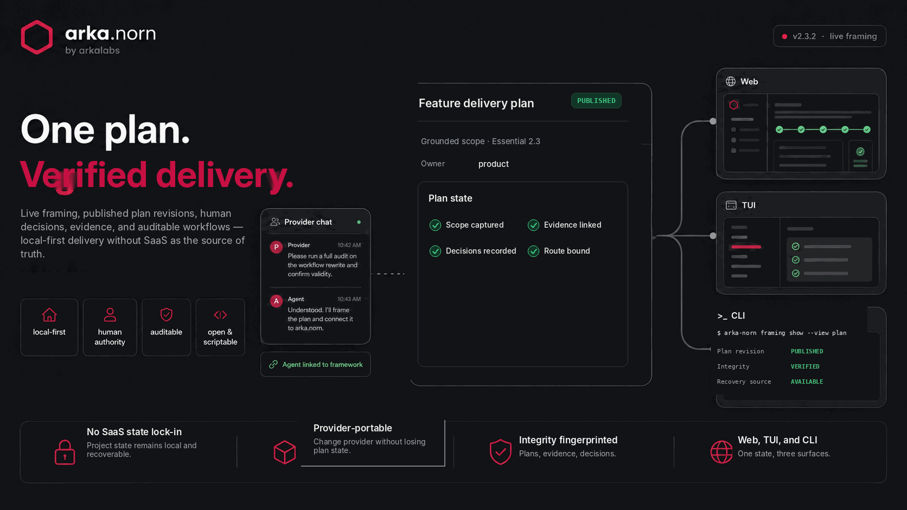
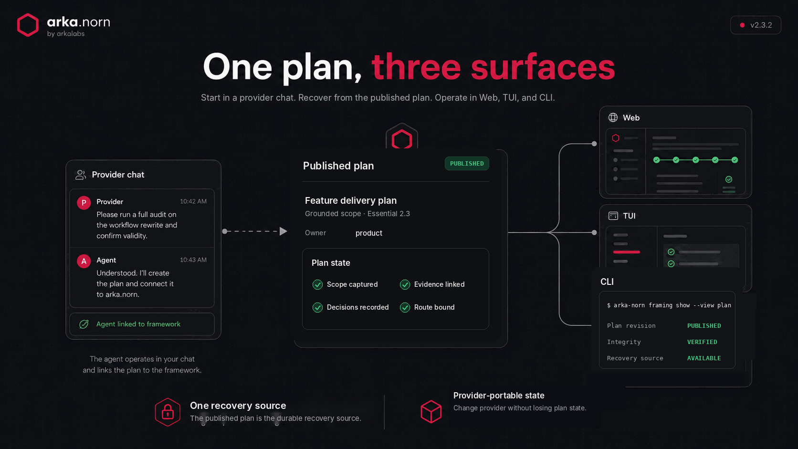
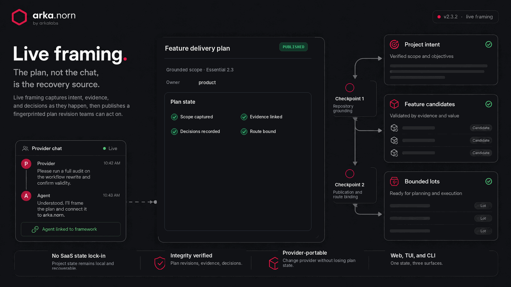
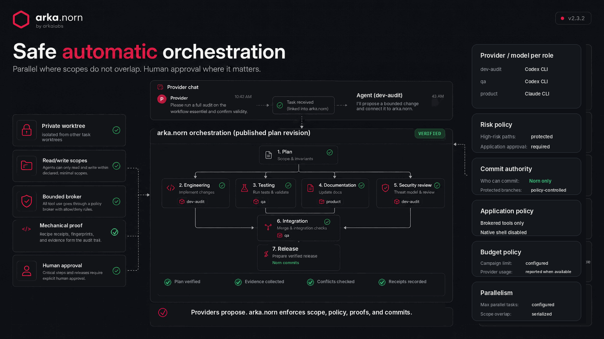
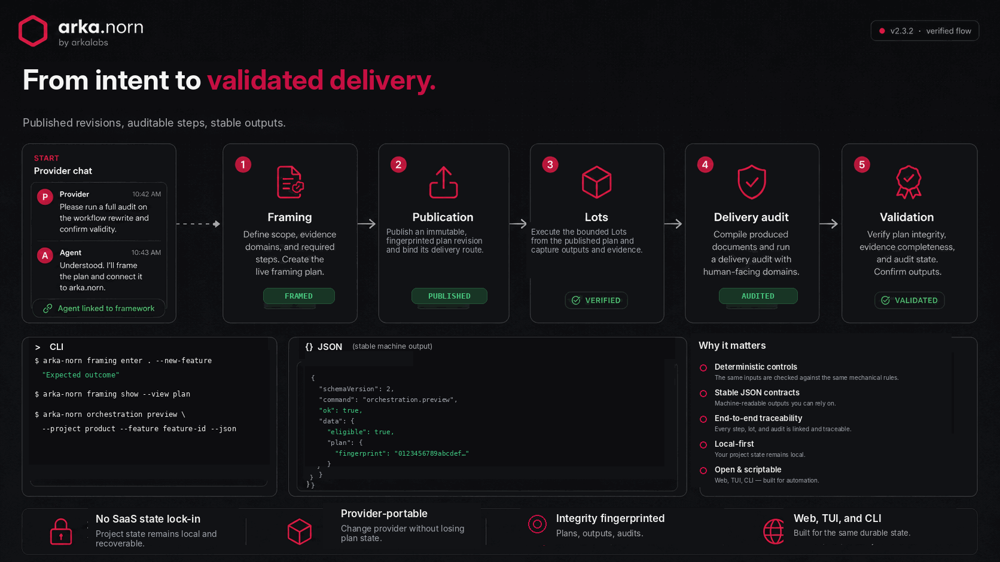

# arka.norn

arka.norn is a local-first delivery framework for Projects, Features, attributed documents, human decisions, evidence, and auditable workflows.

It gives teams one durable recovery source: the published plan.

From a provider chat, an Agent can frame a Project or a Feature, connect that work to arka.norn, and continue across Web, TUI, and CLI without turning a SaaS workspace into the source of truth.

`arka-norn` is the command.

<!-- README IMAGE: hero -->


Version 2.3.5 adds a branded setup with clear next steps and an 'arka-norn version' update check (update, skip until reboot, or skip the version). It builds on 2.3 orchestration control in Norn Web: preview a run, authorize it against the exact plan fingerprint, and apply a verified candidate under the 2.3 invariants, alongside Doctor inspect, preview, and repair, over the 2.3 live framing engine that frames a Project into Feature candidates or a Feature into bounded Lots and hands one exact published revision to the 2.3 delivery DAG.

Legacy 2.2 campaigns are inspection-only. Existing v4 Features keep their historical workflows. English remains canonical for contracts and machine data.

## Why arka.norn

- Start from a provider chat instead of a blank internal workflow
- Recover from the published plan, not from chat history
- Keep the human as the authority on scope, policy, and release
- Operate locally across Web, TUI, and CLI
- Produce attributed, integrity-verified, auditable, reproducible delivery artifacts

## Requirements

- Node.js 22.13 or newer
- npm
- A local repository to manage
- A registered and authenticated execution profile when automatic Agent execution is needed
- Docker or Podman with the Project’s pinned recipe image already present for automatic tests and builds

Supported execution transports for automatic runs:

- Codex CLI
- Claude CLI
- Explicitly diagnosed API / Gemini profiles

## Install

```bash
npm install
npm run build
node bin/arka-norn.mjs --version
node bin/arka-norn.mjs doctor
```

Open the cockpit:

```bash
node bin/arka-norn.mjs
```

## Start in a provider chat

arka.norn does not replace the provider experience. It connects the Agent’s work to a durable local framework.

A typical flow is:

1. You ask for work in a provider chat
2. The Agent frames the task and links it to arka.norn
3. arka.norn publishes an immutable, fingerprinted plan revision
4. The same state becomes available in Web, TUI, and CLI

<!-- README IMAGE: provider-surfaces -->


The plan is the recovery source. If the provider session changes, the Project state remains available through published local artifacts.

## Live framing

Live framing lets a connected Agent create a bounded, resumable plan before delivery.

```bash
arka-norn framing enter .
arka-norn framing enter . --new-feature "The outcome to deliver"
arka-norn framing show --view plan
arka-norn framing show --view evidence
arka-norn framing show --view map
arka-norn framing resume
```

<!-- README IMAGE: live-framing -->


The connected Agent updates the plan through bounded local deltas while the public CLI and Web interface expose human projections.

The plan, not the chat, is the recovery source.

Work in progress remains under `$ARKA_NORN_HOME/framing`. Only a twice-stabilized, fingerprinted revision is published under the Project’s `.arka-norn/plans` directory.

### Human stabilizations

There are exactly two human stabilizations:

1. **Repository grounding**
   Authorizes grounding against the actual repository.

2. **Publication and route binding**
   Binds publication, decomposition, and the calculated delivery route.

An empty repository is never audited. It moves to explicit greenfield design. Implemented code receives an intent-blind structural reading before targeted confrontation.

### Framing outputs

- **Project plans** produce Feature candidates without creating them in bulk
- **Feature plans** produce bounded Lots with scopes, dependencies, and proofs
- A directly framed new Feature is materialized only after publication

Open Project tracking in the browser:

```bash
node bin/arka-norn.mjs web start
node bin/arka-norn.mjs web status
node bin/arka-norn.mjs web restart
node bin/arka-norn.mjs web stop
```

`web` without an action is an alias for `web start`.

The managed server runs in the background, survives the launching terminal, and opens the secured browser session by default.

Useful options:

- `--port 4317`
- `--no-open`
- `--json`

`web restart` preserves the current port and browser session. `web stop` followed by `web start` creates a new secure session. Use `web foreground` only when the server must remain attached to the current terminal.

From a source checkout, the equivalent shortcuts are:

- `npm run web:start`
- `npm run web:status`
- `npm run web:restart`
- `npm run web:stop`

### Web interface

The Web interface presents:

- Project health
- Active framing
- Feature paths
- Attributed documents
- Decisions
- Audits
- Registered Agents
- Live Norn orchestration state

A Project prioritizes its current framing card. Plan, Evidence, Map, and History remain available after a provider or session change.

Starting a new Feature asks only for its expected outcome.

The CLI owns profile registration, preview, run authorization, recovery, and application. The TUI cannot relaunch quarantined 2.2 campaigns.

Project entry and Feature framing are guided for non-developers. Generated identifiers, folder choices, workflows, and advanced technical values stay out of the primary framing flow.

## Safe automatic orchestration

Automatic mode builds a confirmed, fingerprinted task DAG.

Every task gets its own:

- branch
- private Git worktree
- execution profile
- read/write scopes
- mechanical proof

Dependency-ready tasks with disjoint write scopes can run in parallel. Overlapping scopes are serialized before authorization.

Direct automatic execution no longer exists.

<!-- README IMAGE: orchestration -->


The human selects one provider/model profile per role and confirms:

- the plan
- the risk policy
- the commit authority
- the application policy
- the budget
- the parallelism

Agents have no native shell, Git, commit, network, or sub-agent authority.

All reads, proposed changes, Docker or Podman recipes, evidence, and decisions pass through the bounded Norn broker. Norn validates the result and creates the commit.

Choose the preferred tracking surface in Norn Web settings:

- **Web**: functional explanations and a live read-only timeline, with no command blocks
- **TUI**: manual workflow and Agent identity management, with an explicit handoff to the 2.3 CLI for automatic runs
- **CLI**: exact commands and stable JSON for expert automation

See [Automatic orchestration](https://github.com/arka-squad/arka-norn/blob/main/docs/automatic-orchestration.md) for workspace, budget, recovery, and application guarantees.

Install the generated Agent skills:

```bash
node bin/arka-norn.mjs install --global
node bin/arka-norn.mjs skills doctor
```

## Language

English is canonical for:

- code
- commands
- identifiers
- JSON fields
- schemas
- public documentation

Display text can be English or French.

```bash
arka-norn locale show
arka-norn locale set en
arka-norn locale set fr
arka-norn locale set auto
arka-norn --locale fr workflow list
ARKA_NORN_LOCALE=en arka-norn doctor
```

Resolution order is:

1. `--locale`
2. `ARKA_NORN_LOCALE`
3. saved preference
4. system locale
5. English

Preferences are stored atomically in `$ARKA_NORN_HOME/.arka-norn/preferences.json` and never enter portable Project or Feature markers.

Machine JSON always uses canonical English values. Only its `display` block varies by locale.

## Workflows

| Workflow | Use it for | Required path |
|---|---|---|
| Essential 2.3 | New grounded Features with bounded Lots | `development_report -> delivery_audit -> delivery_validation` |
| Complete 2.3 | Grounded higher-risk Features whose downstream consumers require technical artifacts | Required technical contracts, delivery, audit, and validation |
| Essential legacy | Existing well-understood v4 Features | `feature_brief -> development_report -> delivery_audit -> delivery_validation` |
| Complete legacy | Existing v4 Features with the historical full document chain | Concept, plan, evidence, invariants, tasks, specification, delivery, and QA |
| FastDev | Small, bounded corrections and refactors | `rework_brief -> development_report -> delivery_audit -> delivery_validation` |

`technical_contract_appendix` is optional in Essential.

Delivery audits can require a corrective `development_report`. Validation always targets the latest report.

```bash
arka-norn workflow list
arka-norn workflow show essential
arka-norn essential start "Filter Features by status" --project product
arka-norn essential next <feature-id> --session <session-id> --json
```

Deprecated aliases `standard` and `essentiel` remain accepted with warnings throughout 2.x. Existing legacy Features continue on their French v3 contract until explicitly migrated.

## Verified flow

The delivery chain remains attributed, integrity-verified, auditable, and machine-readable from framing to validation.

<!-- README IMAGE: verified-flow -->


```bash
cd /workspace/product
arka-norn framing enter . --new-feature "Filter Features by status"
arka-norn framing resume
arka-norn framing show --view plan

# After the connected Agent obtains the second stabilization and publishes:
arka-norn agent advise --project product --feature filter-features
arka-norn pipeline next filter-features --json
```

A v5 document uses English field names and declares the prose locale:

```json
{
  "schema_version": 5,
  "content_locale": "fr",
  "id": "brief-filter-features-01",
  "feature_id": "filter-features",
  "type": "feature_brief",
  "sequence": 1,
  "created_at": "2026-08-23T09:00:00.000Z",
  "depends_on_document_ids": [],
  "author_agent_id": "Codex_product_20260823"
}
```

## Migration

The reader accepts legacy French v2/v3 Feature documents and Project audit v4 documents without rewriting them.

```bash
arka-norn migrate --target /workspace/product/feature
arka-norn migrate --target /workspace/product/feature --apply
```

Migration validates the whole Feature first, creates backups, preserves identity and graph relations, translates fields and enums, records the source version and SHA-256, and commits the marker last.

Unknown, mixed, or ambiguous contracts stop the entire operation.

Repeating a successful migration is a no-op.

Framing does not silently migrate existing Feature markers. Marker v4 remains on its historical pipeline. Marker v5 requires `pipelineDefinitionVersion: 2.3` and an exact `framingPlanRef`.

See [Migration to live framing](https://github.com/arka-squad/arka-norn/blob/main/docs/migration-2.3.2.md).

## JSON API

Public CLI JSON uses `schemaVersion: 2`:

```json
{
  "schemaVersion": 2,
  "command": "pipeline.status",
  "ok": true,
  "data": {},
  "errors": [],
  "warnings": [],
  "diagnostics": {
    "errors": [],
    "warnings": []
  },
  "display": {
    "locale": "en",
    "errors": [],
    "warnings": []
  }
}
```

Scripts must depend on:

- `data`
- stable diagnostic codes
- diagnostic parameters

They must never depend on localized `display` prose.

## Documentation

- [User guide](https://github.com/arka-squad/arka-norn/blob/main/docs/user-guide.md)
- [CLI reference](https://github.com/arka-squad/arka-norn/blob/main/docs/cli.md)
- [TUI guide](https://github.com/arka-squad/arka-norn/blob/main/docs/tui.md)
- [Project Web guide](https://github.com/arka-squad/arka-norn/blob/main/docs/web.md)
- [Essential workflow](https://github.com/arka-squad/arka-norn/blob/main/docs/essential.md)
- [FastDev workflow](https://github.com/arka-squad/arka-norn/blob/main/docs/fastdev.md)
- [Agent guide](https://github.com/arka-squad/arka-norn/blob/main/docs/agent-guide.md)
- [Agent orchestration](https://github.com/arka-squad/arka-norn/blob/main/docs/agent-orchestration.md)
- [Developer guide](https://github.com/arka-squad/arka-norn/blob/main/docs/developer-guide.md)
- [Architecture](https://github.com/arka-squad/arka-norn/blob/main/docs/architecture.md)
- [Security](https://github.com/arka-squad/arka-norn/blob/main/docs/security.md)
- [Troubleshooting](https://github.com/arka-squad/arka-norn/blob/main/docs/troubleshooting.md)
- [Live framing contract](https://github.com/arka-squad/arka-norn/blob/main/docs/norn-framing-contract-proposal.md)
- [Framing Product and UX method](https://github.com/arka-squad/arka-norn/blob/main/docs/norn-framing-method-research.md)
- [Migration to live framing](https://github.com/arka-squad/arka-norn/blob/main/docs/migration-2.3.2.md)
- [Stability contract 2.3](https://github.com/arka-squad/arka-norn/blob/main/docs/stability-2.3.md)

Canonical examples are under:

- `examples/feature-complete`
- `examples/feature-essential`
- `examples/feature-fastdev`
- `examples/project-audit-v5`

## Quality

```bash
npm run lint
npm run typecheck
npm test
npm run selftest
npm run release:verify
npm run metrics:adoption
```

Source files are limited to 700 lines.

Canonical code and public documentation are checked for French text. Generated skills, examples, and Web locale catalogs come from shared canonical sources. Production Web assets are built into `dist/web/` and shipped in the npm package.

`metrics:adoption` is a maintainer-only, read-only report. It combines public npm download counts with the authenticated GitHub clone-traffic window exposed by `gh`.

Use:

```bash
npm run metrics:adoption -- --json
```

for automation.

Norn itself includes no installation telemetry. npm downloads are not unique installations, and GitHub clone traffic covers only the rolling 14-day window.

`.input/` is an ignored internal workspace. It is not packaged, published, or included in public CI.

## License

Apache-2.0. See [LICENSE](https://github.com/arka-squad/arka-norn/blob/main/LICENSE) and [NOTICE](https://github.com/arka-squad/arka-norn/blob/main/NOTICE).
