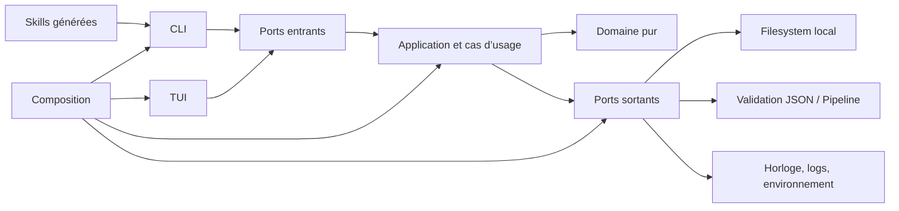

# Guide développeur Arka Norn

Ce guide est la référence pratique pour comprendre, modifier, tester et livrer Arka Norn. Il complète la [documentation d’architecture](architecture.md), qui décrit les décisions structurelles, et la [référence CLI](cli.md), qui décrit le contrat public.

## 1. Ce que vous développez

Arka Norn est un plan de contrôle local-first. Il ne réalise pas le travail métier à la place des humains ou des Agents : il organise les ressources, calcule la prochaine étape autorisée, valide les preuves et conserve la traçabilité.

Les interfaces suivantes partagent le même moteur :

- CLI humaine et JSON ;
- TUI interactive ;
- skills Claude/Codex générées depuis un catalogue ;
- scripts de diagnostic, migration et release.

La règle structurante est : **une règle métier n’appartient jamais à la CLI ou à la TUI**. Elle doit vivre dans le domaine ou dans un cas d’usage, puis être consommée par les deux interfaces.

## 2. Prérequis et installation locale

### Environnement

- Node.js `>= 20.11` ;
- npm compatible avec la version de Node utilisée ;
- Git ;
- un terminal TTY pour tester la TUI.

### Mise en route

```bash
git clone https://github.com/arka-squad/arka-norn.git
cd arka-norn
npm install
npm link
arka-norn selftest
```

`npm link` expose la commande globale `arka-norn` vers le worktree. Pendant un développement, utilisez de préférence `node bin/arka-norn.mjs …` dans les scripts reproductibles afin de savoir exactement quelle copie est exécutée.

### Boucle de travail recommandée

```bash
npm run typecheck
npm run test:unit
npm run build
```

Avant un commit :

```bash
npm run check
npm test
git diff --check
```

Avant une release :

```bash
npm run release:verify
```

## 3. Modèle mental du domaine

```text
Project
├── Product principal (session main)
├── Registre Agents
├── Sessions spécialisées
└── Feature
    ├── pipelineId
    ├── Documents signés
    ├── Runs de développement / validation
    └── Handoffs
```

Les termes canoniques sont définis dans le [vocabulaire du domaine](domain/vocabulaire.md). N’introduisez pas de synonyme dans les interfaces publiques quand un terme existe déjà.

### Invariants importants

1. Une Feature appartient explicitement à un Project.
2. Son `pipelineId` est résolu uniquement par le catalogue fermé.
3. Tout document de Feature v3, et tout audit Project v4, possède un `author_agent_id` connu et autorisé ; leurs scopes `feature_id` et `project_id` ne se mélangent jamais.
4. Le Product principal occupe `main`; un rôle spécialisé ne peut pas sélectionner cette session.
5. Un Pipeline ne se termine pas sur la seule conformité JSON : le verdict métier doit viser le dernier CR livré.
6. Les marqueurs portables sont les sources de vérité ; les index locaux restent reconstructibles.
7. Une lecture ou une commande de diagnostic ne répare jamais silencieusement l’état.

## 4. Architecture du code



### Répertoires

| Chemin | Responsabilité |
|---|---|
| `src/domain/` | Entités, value objects, invariants et politiques Pipeline pures. |
| `src/application/` | Orchestration métier sans dépendance à la présentation. |
| `src/use-cases/` | Cas d’usage Project, Feature et Agent. |
| `src/ports/inbound/` | Contrats offerts à la CLI et à la TUI. |
| `src/ports/outbound/` | Contrats du stockage, de la validation et du système. |
| `src/adapters/inbound/cli/` | Parsing strict, présentation humaine/JSON et codes de sortie. |
| `src/adapters/inbound/tui/` | Composants, runtime et vues terminal. |
| `src/adapters/outbound/` | Filesystem, Pipeline, skills et services système. |
| `src/composition/` | Câblage des adapters, runtimes et contrôleurs TUI. |
| `schemas/` | Contrats JSON des marqueurs et documents. |
| `pipelines/` et `pipeline.json` | Catalogue fermé et définitions des workflows. |
| `skills-src/` | Sources canoniques des 18 skills. |
| `tests/` | Tests unitaires, intégration et E2E. |
| `dist/` | JavaScript compilé et source maps, régénérés par `npm run build`. |

### Sens des dépendances

Le domaine ne dépend ni de Node.js, ni du filesystem, ni de la CLI. L’application dépend des ports. Les adapters implémentent les ports. La composition assemble le tout.

Si une classe du domaine commence à importer `node:fs`, `process`, un renderer TUI ou un parseur CLI, la frontière est probablement incorrecte.

## 5. Sources de vérité et persistance

| Donnée | Source de vérité | Propriété |
|---|---|---|
| Project | `<project>/.arka-norn/project.json` | portable, versionnée avec le Project |
| Feature | `<feature>/.arka-norn/feature.json` | portable, contient `projectId` et `pipelineId` |
| Agents | `<project>/.arka-norn/agents.json` | partagé, historique des identités |
| Session courante | `~/.arka-norn/context/agents.json` | privée à la machine |
| Documents | JSON présents sous la Feature | preuves métier |
| Index | `~/.arka-norn/index/*.json` | cache reconstructible |
| Audit | `~/.arka-norn/logs/audit.jsonl` | journal privé et rotatif |

Les écritures persistantes passent par les helpers atomiques et les locks existants. Ne remplacez pas ces adapters par un `writeFile` direct dans un nouveau cas d’usage.

Les marqueurs v3 ne stockent aucun chemin absolu. Leur racine runtime est dérivée après canonicalisation du dossier qui les contient. Toute modification de format nécessite une lecture compatible, une migration avec backup et des tests de déplacement.

## 6. Moteur Pipeline

### Résolution sécurisée

`pipelines/catalog.json` est la seule table de résolution autorisée. Une valeur utilisateur ne doit jamais devenir un chemin de définition. Un identifiant inconnu échoue sans fallback.

### Évaluation

Le `PipelineReport` sépare :

- présence du document ;
- conformité au schéma ;
- dépendances ;
- verdict métier ;
- complétude ;
- prochaine action, raison, instructions et commande suggérée.

Les politiques métier disponibles sont :

| Politique | Usage |
|---|---|
| `delivery` | Sélectionne le dernier CR livré. |
| `audit_then_fix` | Audite le dernier CR et exige une correction complète si nécessaire. |
| `review_latest` | Rend une ancienne validation obsolète après un nouveau CR. |

Le pipeline standard se trouve dans `pipeline.json`. FastDev se trouve dans `pipelines/arka-norn-fastdev.json`.

Une inspection avec `featureId` représente une Feature gérée : elle reçoit
obligatoirement le registre Agent du Project. Une absence ou corruption de
registre rend le rapport invalide ; ne dégradez jamais ce cas en warning. Les
dossiers sans marker restent le seul mode de compatibilité explicite.

### Ajouter ou modifier un type de document

1. Définir le schéma sous `schemas/` avec des contraintes explicites.
2. Référencer ce schéma depuis une définition Pipeline connue du catalogue.
3. Ajouter la logique métier pure uniquement si les politiques existantes ne suffisent pas.
4. Vérifier le scaffold généré et ses sentinelles.
5. Ajouter des exemples valides et invalides.
6. Couvrir dépendances, verdicts, obsolescence et auteur dans les tests unitaires.
7. Couvrir le parcours CLI/TUI si l’étape devient publique.
8. Mettre à jour les skills et la documentation concernées.

Un document au scope Project ne doit pas être ajouté implicitement au Pipeline
d’une Feature. L’unique extension actuelle est `audit_etat_reel` v4, porté par
`project-audit-envelope.schema.json`; conservez v2/v3 pour les Features.

Ne rendez pas une étape « complète » dans un presenter. Le verdict doit être calculé avant l’arrivée dans l’interface.

## 7. Agents et orchestration Product

Une identité Agent suit le format humain `Provider_role_YYYYMMDD`, avec suffixe seulement en cas de collision réelle. Le registre conserve le provider, le rôle, le scope, l’état actif et la lignée de remplacement.

### Sessions

`AgentSessionId` est limité à `[a-z][a-z0-9-]{0,63}`. La sélection privée est indexée par session puis Project.

```text
main                     Product principal
architecte-<feature>     Architecture
audit-<feature>          Audit
dev-<feature>            Développement
qa-<feature>             Recette
```

L’orchestrateur pur dans `src/application/agents/agent-orchestration.ts` :

- mappe l’étape suivante au rôle responsable ;
- distingue `execute` et `prepare` ;
- choisit le profil de skills ;
- génère le préflight et le prompt d’initialisation ;
- génère le prompt de reprise du Product.

Le runtime charge Project, Feature, registre, sessions et rapport Pipeline. Les interfaces ne doivent pas refaire ce calcul.

### Ajouter un rôle orchestré

1. Étendre le type public du rôle.
2. Définir sa politique de skill et de profil.
3. Mapper uniquement les étapes qu’il est autorisé à exécuter.
4. Définir ses responsabilités par défaut.
5. Mettre à jour le parseur CLI et les écrans TUI.
6. Tester refus dans `main`, prompt `prepare`, prompt `execute` et réutilisation de session.

## 8. CLI

Le routeur se trouve dans `src/adapters/inbound/cli/main-cli.ts`. Chaque famille possède un parseur strict et retourne un `CliExecution` contenant code, stdout et stderr.

### Contrat JSON

Une sortie `--json` ne doit contenir aucun log parasite sur stdout :

```json
{
  "schemaVersion": 1,
  "command": "pipeline.next",
  "ok": true,
  "data": {},
  "errors": [],
  "warnings": []
}
```

### Ajouter une commande

1. Définir ou réutiliser un port entrant.
2. Implémenter la règle dans le domaine/application, pas dans le switch CLI.
3. Ajouter la spec d’arguments stricte : positionnels, options et relations.
4. Définir une présentation humaine actionnable.
5. Préserver l’enveloppe JSON et les codes de sortie.
6. Ajouter des tests humains, JSON et d’options inconnues.
7. Mettre à jour `help`, `guide`, `docs/cli.md` et le README si la commande est structurante.

Les codes publics sont documentés dans la [référence CLI](cli.md).

## 9. TUI

La TUI fonctionne comme une pile de scènes. Les composants ne connaissent pas le domaine ; les contrôleurs composent les cas d’usage ; les vues rendent un modèle déjà calculé.

Principes :

- aucune exécution de sous-processus CLI depuis la TUI ;
- une seule action asynchrone en cours par scène ;
- une confirmation avant une mutation sensible ;
- une aide `?` contextualisée ;
- une prochaine action visible après chaque résultat ;
- un rendu dégradé explicite sous la largeur minimale.

Pour une nouvelle interaction, ajoutez au minimum un test clavier et, si elle touche le métier, un test E2E utilisant le vrai runtime.

## 10. Skills

Les fichiers sous `.agents/skills/` et `.claude/skills/` sont générés. Ne les modifiez jamais comme sources.

Pour modifier une skill :

1. éditer `skills-src/<skill>.json` ;
2. recalculer son SHA-256 normalisé ;
3. mettre à jour version et checksum dans `skills-src/catalog/skills.json` ;
4. lancer les tests du catalogue ;
5. installer en dry-run ;
6. régénérer les copies locales/globales avec consentement explicite en cas de divergence.

```bash
arka-norn skills install --target . --profile all --dry-run
arka-norn skills doctor --target . --profile all --global --json
```

Une skill doit dire quand l’utiliser, quand ne pas l’utiliser, quels inputs sont obligatoires, comment s’arrêter et quel format rendre. Elle ne doit jamais demander à l’Agent de deviner un Project, une Feature, une session ou une étape.

## 11. Tests et qualité

| Gate | Ce qu’elle couvre |
|---|---|
| `npm run lint` | Style et complexité statique. |
| `npm run typecheck` | Sources et tests TypeScript. |
| `npm run test:unit` | Domaine, règles pures, catalogue et composants isolés. |
| `npm run test:integration` | Filesystem, concurrence, migrations, doctor et skills. |
| `npm run test:e2e` | CLI réelle, TUI pilotée et packaging consumer. |
| `npm run test:coverage` | Tous les tests avec seuils globaux. |
| `npm run benchmark` | Budgets de scan et dashboard. |
| `npm run selftest` | Contrats essentiels du produit installé. |
| `npm run release:verify` | Gates, couverture, benchmark, audit npm et tarball. |

### Choisir le bon niveau de test

- Règle métier : test unitaire pur.
- Écriture, lock ou migration : test d’intégration avec dossier temporaire.
- Commande publique : E2E humain et JSON.
- Parcours TUI : test clavier.
- Distribution : installation du tarball dans un consumer vierge.

Un test ne doit pas dépendre du vrai `~/.arka-norn`. Utilisez un home temporaire et nettoyez-le dans le teardown.

## 12. Sécurité

Traitez comme non fiables :

- chemins et racines ;
- marqueurs et JSON ;
- symlinks ;
- environnement ;
- locks et processus concurrents ;
- skills déjà présentes ;
- réponses d’un chat web ;
- identifiants et options CLI.

Avant toute écriture, vérifiez le confinement, l’auteur actif, le scope Feature et le scope chemin. N’ajoutez pas de fallback permissif après une erreur de catalogue ou de registre.

Consultez [Sécurité locale](security.md) avant toute modification de persistance, migration, installation ou exécution concurrente.

## 13. Diagnostic

```bash
arka-norn doctor --json
arka-norn doctor --repair --json
arka-norn skills doctor --target . --profile all --global --json
arka-norn project scan . --json
arka-norn feature scan --project <project-id> --path . --json
```

`doctor --repair` produit uniquement un plan. `--repair --apply` est nécessaire pour l’appliquer. Ne transformez jamais un diagnostic en mutation implicite.

Pour isoler les données locales d’un scénario manuel, utilisez un répertoire temporaire via `ARKA_NORN_HOME`, puis supprimez uniquement ce répertoire une fois le test terminé.

## 14. Git et release

- Ne mélangez pas une migration, un changement métier et une refonte documentaire dans le même commit sans raison explicite.
- Stagez les fichiers ciblés, jamais tout le worktree par défaut.
- Régénérez `dist/` après une modification TypeScript.
- Ne versionnez pas `.input/`, les couvertures ou les caches.
- Vérifiez le worktree avant et après les tests générateurs.

La distribution officielle est un tarball attaché à un tag `vX.Y.Z`. La [procédure de release](release.md) couvre version, changelog, checksums, SBOM, provenance et rollback.

## 15. Définition de fini d’un changement

Un changement est prêt lorsque :

- le comportement public est documenté ;
- les frontières d’architecture sont respectées ;
- les scénarios nominaux et les refus sont testés au bon niveau ;
- `dist/` correspond aux sources ;
- `npm run check` et les tests concernés passent ;
- les nouveaux chemins d’écriture sont audités pour le confinement et la concurrence ;
- les sorties humaines expliquent la prochaine action ;
- les sorties JSON restent compatibles ;
- le diff ne contient ni secret, ni cache, ni travail d’un autre scope ;
- la release complète passe lorsque le changement touche le package distribué.
